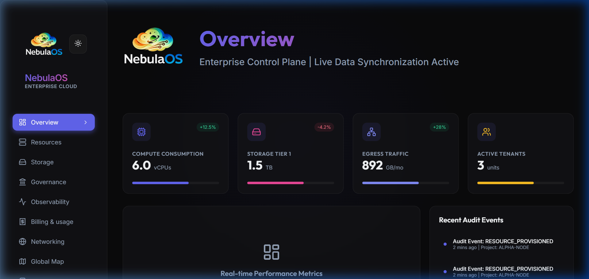
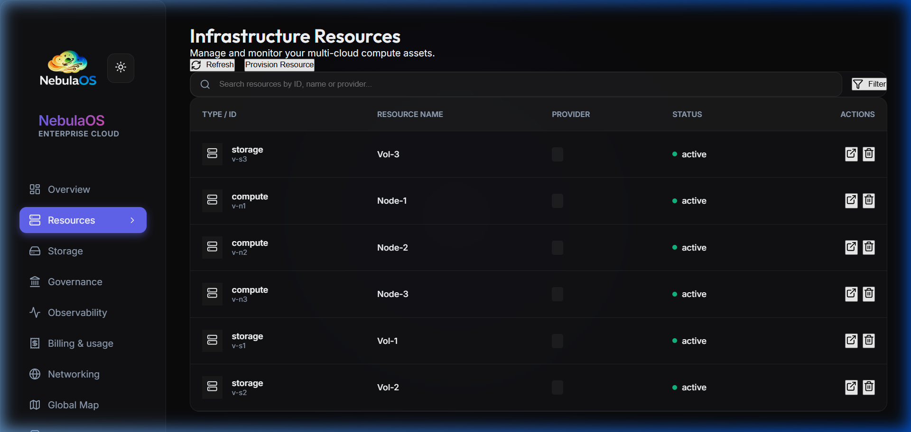
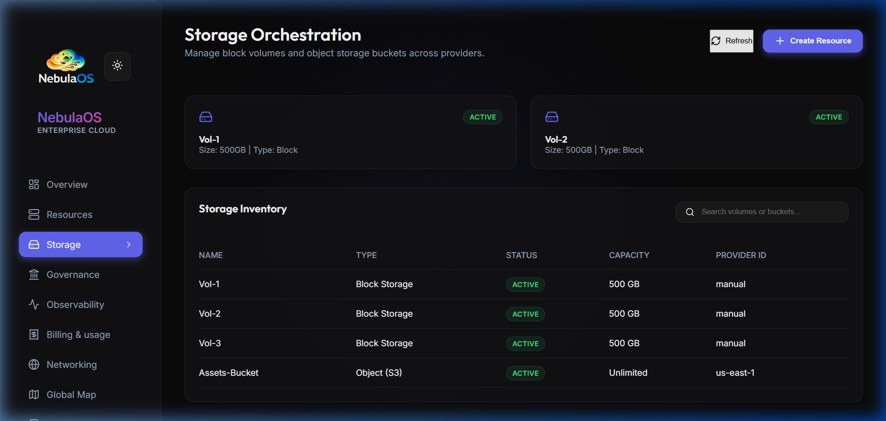
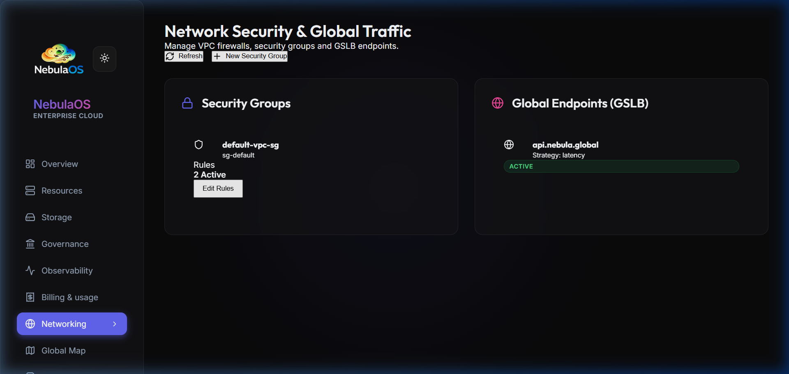
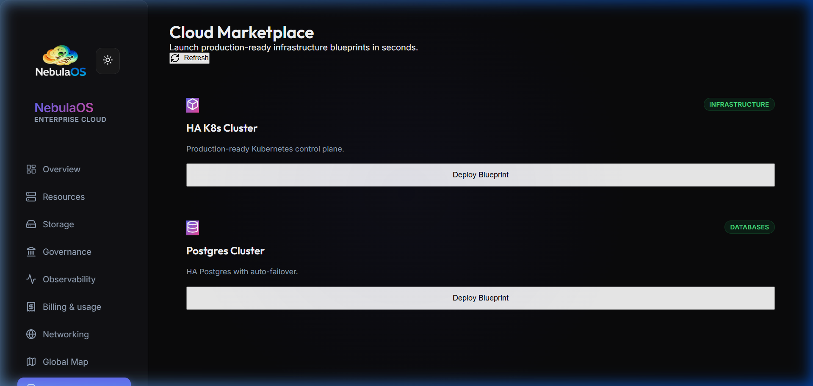
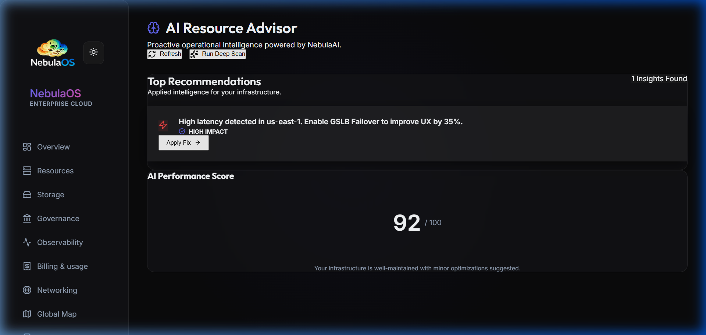
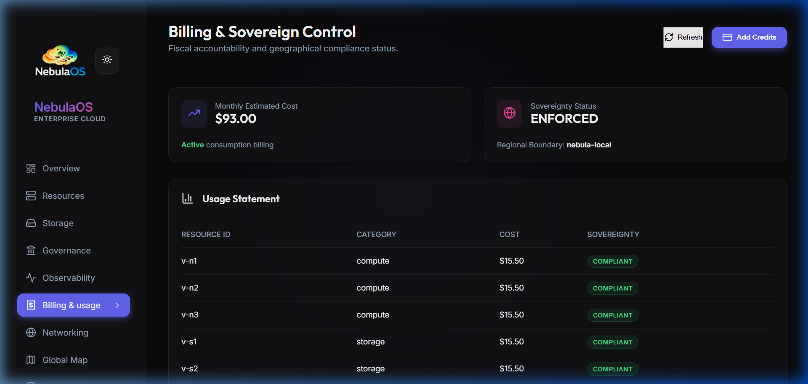

# NebulaOS

NebulaOS is a sovereign cloud management platform designed for high-performance, multi-region infrastructure orchestration. The dashboard provides a glassmorphic, data-driven interface for managing compute, storage, networking, and intelligence assets.

## Features

- **Enterprise Hierarchy**: High-level Organization and Department management for multi-tenant scaling.
- **Bare Metal Orchestration**: Centralized physical node inventory with iPXE/Redfish automation.
- **One-Click Startup**: Automated platform bootstrap via `nebula.sh`.
- **Live Infrastructure Telemetry**: Real-time stats for CPU, Storage, and Tenant activity.
- **Resource Inventory**: Unified management of cross-provider compute and storage assets.
- **Network Security & GSLB**: Intelligent multi-region traffic orchestration and VPC firewall management.
- **Marketplace**: One-click deployment of production-ready blueprints (K8s, Postgres, etc.).
- **AI Strategy Advisor**: Operational insights and performance optimization recommendations.
- **Sovereign Billing**: Transparent cost auditing with tenant-level granularity.
- **Self-Healing Infrastructure**: Automatic detection and recovery of core platform dependencies.

## Visual Walkthrough

### Dashboard Overview
The command center for your entire cloud infrastructure, featuring real-time telemetry and project status.


### Infrastructure Resources
A detailed inventory of all compute and storage assets, synchronized in real-time with the backend orchestration engine.


### Storage Orchestration
Dedicated management of block volumes and object storage buckets with provider-agnostic controls.


### Network Security & GSLB
Manage Global Traffic Strategy and security group rules for robust perimeter defense.


### Marketplace Blueprint Engine
Seamlessly deploy complex infrastructure stacks using pre-validated blueprints.


### AI Strategy Advisor
Intelligent insights that help optimize resource utilization and security posture.


### Enterprise Hierarchy
Manage multi-tenant organizations and departments with granular isolation and cost tracking.


### Bare Metal Orchestration
Centralized inventory of physical servers with live iPXE provisioning logs and hardware state tracking.


### Sovereign Billing & Analytics
Full transparency into infrastructure costs and consumption patterns.


## Platform Orchestration

For a complete, one-click production-ready setup:

**Linux / Mac:**
```bash
./nebula.sh
```

**Windows (PowerShell):**
```powershell
.\nebula.ps1
```

This script automates infrastructure dependencies (Postgres, NATS), seeds the default Enterprise Org, and starts the API/Dashboard.

## Manual Development Setup

### Backend (Go)
```bash
cd src/api
go run cmd/server/main.go
```

### Frontend (React + Vite)
```bash
cd src/dashboard
npm install
npm run dev
```

The dashboard will be available at `http://localhost:5173`.
