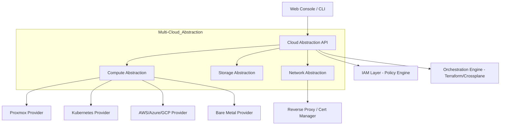

# NebulaOS Architecture Blueprint

## 1. Layered Architecture (High-Level)

## 2. Service Responsibilities
*   **Cloud Abstraction API:** The single entry point. Standardizes requests for resources regardless of the target provider.
*   **IAM Layer:** Enforces RBAC and Policy-based access. Validates every API call against the tenant's security model.
*   **Multi-Cloud Abstraction:** Translates generic requests (e.g., "Create VM") into provider-specific IaC templates or API calls.
*   **Network Edge:** Manages VPCs, Subnets, and the automated orchestration of SSL certificates and reverse proxies.

## 3. Communication Patterns
*   **External:** RESTful JSON API for the Console and CLI.
*   **Internal:** Event-Driven (NATS or RabbitMQ) for asynchronous task execution (e.g., provisioning a VM).
*   **Orchestration:** GitOps-based state management using ArgoCD for internal service deployment.

## 4. Scalability Strategy
*   **Horizontal Scaling:** All API and IAM services are stateless and can be scaled horizontally behind a load balancer.
*   **Modular Providers:** New infrastructure providers can be added as standalone microservices/plugins without impact on the core.
*   **Sharding:** Tenant data and logs can be sharded by organization to ensure performance at scale.
