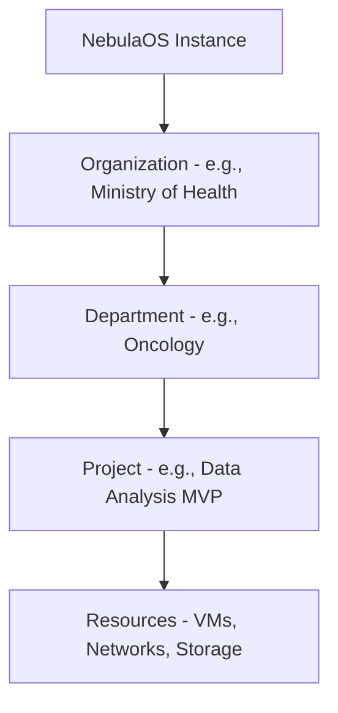

# NebulaOS Governance & Multi-Tenancy Model

## 1. Tenant Hierarchy Model
NebulaOS uses a strict hierarchical model to manage resources and access:

*   **Organization:** The primary unit of isolation. Corresponds to a Keycloak Realm and a billing/quota entity.
*   **Department:** Logical grouping for internal organization management and granular RBAC.
*   **Project:** A sandbox for resources. All technical resources must belong to a project.

## 2. Resource Ownership & Tagging
Every resource in NebulaOS is automatically tagged with ownership metadata:
- `nebula:org-id`: UUID of the parent Organization.
- `nebula:project-id`: UUID of the specific Project.
- `nebula:created-by`: Service Account or User ARN.

## 3. Quotas & Limits
Governance is enforced through quotas at the Organization and Project levels:
- **Compute:** Max CPU cores, RAM (GB), and Instance count.
- **Storage:** Max Disk (GB) and Object Storage capacity.
- **Network:** Max VPCs, Public IPs, and Bandwidth limits.

## 4. Sovereignty & Compliance
- **Region Locking:** Tenants can specify mandatory regions for their resources (e.g., "Must stay within Brazil West").
- **Audit Logging:** Every management action is recorded in an immutable, tenant-specific audit log.
- **Sovereignty Enforcement:** The Cloud API rejects any provisioning request that violates region-locking or compliance policies.

## 5. Billing Abstraction
NebulaOS includes a billing abstraction layer to track consumption. While the core is open source and non-commercial, this allows institutional chargebacks or internal cost management.
